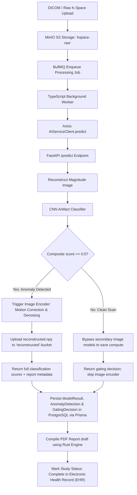
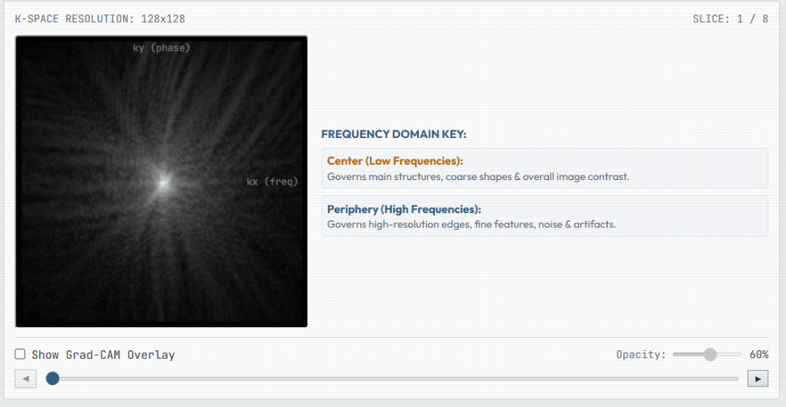
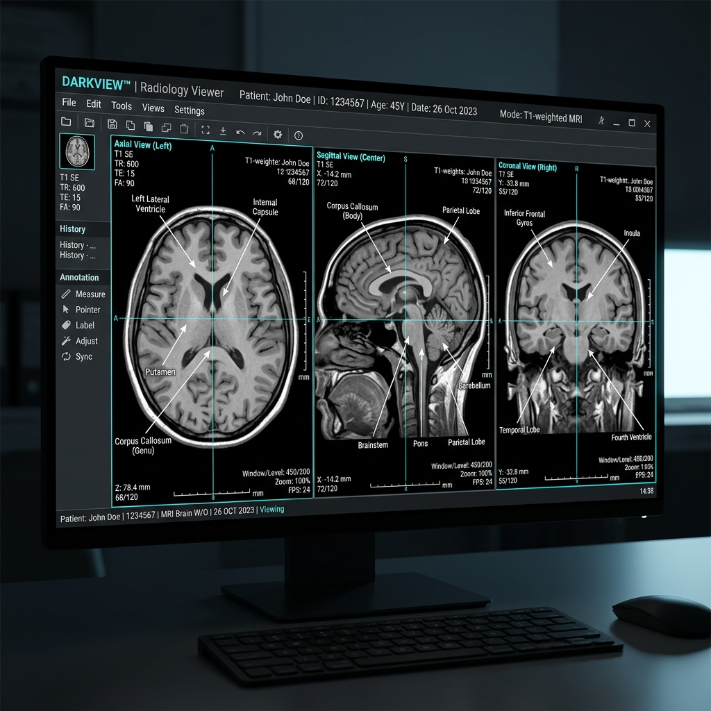

# 🧠 MedMatrix (KVISION)

[](ai-service/inference)
[](ai-service/inference)
[](rust-mri)
[](apps/backend)
[](ai-service)
[](LICENSE)

**MedMatrix** (also known as **KVISION**) is an enterprise-grade clinical MRI volumetric analysis, k-space anomaly detection, digital brain twin simulation, and automated reporting platform. Built inside a modular `pnpm` monorepo, it seamlessly couples state-of-the-art Deep Learning (Hybrid S4 State-Space Models + Spatial Convolutions) with high-performance native compute engines (C++ ONNX Runtime and Rust FFT reconstruction) and a Syngo-themed clinical desktop console (Electron + React).

---

## 🏛️ System Architecture & Workflow

MedMatrix operates an automated, two-tier AI cascade to optimize compute budget while ensuring high diagnostic quality on raw multi-coil MRI acquisition streams.



---

## 🚀 Key Features

* **⚡ Two-Tier AI Gating Cascade:** Automatically detects hardware artifacts and scan corruption (ghosting, wrap-around, zipper noise) prior to heavy model execution. Clean scans bypass computationally expensive modules to maintain high patient throughput.
* **🧠 Hybrid Fused S4-CNN Volumetric Classifier:** Merges complex-domain frequency sequence analysis (Diagonal State Space Model - S4D) with spatial magnitude slice representations via **Slice-Level Cross-Attention**. Achieves **88.28% validation accuracy** across 11 pathology classes with only **~281k parameters** (vs ~67M in traditional 3D CNNs).
* **📈 SSM-Based K-Space Anomaly Estimator:** Real-valued diagonal State Space Model reading multi-coil raw complex K-space data row-by-row to predict continuous regression metrics for noise severity, motion blur, and phase corruption.
* **🚀 C++ ONNX Runtime Engine:** Native C++ executables (`kvision::InferenceEngine` & `kvision::AnomalyDetectorEngine`) compiled with CMake and CUDA GPU support, achieving up to 84.8 inferences/second.
* **🦀 Native Rust MRI Reconstruction & PDF Engine:** Phase-corrected 2D centered IFFT slice reconstruction module coupled with a high-speed, native clinical PDF report generator.
* **💻 Syngo-Themed Clinical Desktop App:** Electron desktop console adhering to modern clinical Syngo UI design guidelines. Includes raw DICOM ingestion, Cornerstone3D multi-planar viewers, frequency domain k-space visualizers, and Digital Brain Twin node graphs.
* **🧬 Synthetic Data & Phantom Generation (`data-gen`):** Complete Python simulation suite for generating multi-coil k-space arrays, numerical brain phantoms (PhantomNet), and benchmark pathology datasets.

---

## 📺 UI/UX Clinical Showcase

### 1. 3D Volumetric Brain & Lesion Visualizer
Provides interactive 3D mesh renderings overlaying tumor volumes, hemorrhage regions, and lesion nodes using Three.js and VTK.js.



### 2. 2D Clinical Slice Viewer
Multi-planar slice viewer powered by Cornerstone3D, featuring seamless scrolling across axial, sagittal, and coronal slice planes with AI segmentation overlays.

#### Spatial Domain (Reconstructed MRI Slice)


#### Frequency Domain (Raw K-Space Acquisition)


---

## 🗺️ Monorepo Navigation Dashboard

The MedMatrix repository is organized as a workspace monorepo managed with `pnpm`.

```
Med_Matrix/
├── 🐳 docker-compose.yml        <- Infrastructure orchestration (Postgres, Redis, MinIO)
├── 🤖 ai-service/                <- Python FastAPI + PyTorch AI microservice
│   └── ⚙️ inference/             <- C++ ONNX Runtime Inference Engine (CMake)
├── 📱 apps/
│   ├── 🖥️ electron/             <- Electron + React + TypeScript clinical desktop application
│   └── 🌐 backend/              <- Node.js Express server + Prisma ORM + BullMQ worker
├── 🧬 data-gen/                 <- Synthetic MRI & PhantomNet data generator
├── 🦀 rust-mri/                  <- High-speed Rust reconstruction & PDF compiler
└── 📦 packages/
    ├── ⚙️ config/               <- Shared ESLint, Prettier, and TypeScript configurations
    └── 🧩 shared-types/         <- Shared TypeScript interfaces across client and backend
```

### 🗂️ Module Documentation Links:
* **[ai-service/README.md](ai-service/README.md)** — Python AI microservice, PyTorch architectures, and FastAPI endpoints.
* **[ai-service/inference/README.md](ai-service/inference/README.md)** — High-performance C++ ONNX Runtime engine & builds.
* **[apps/backend/README.md](apps/backend/README.md)** — Express REST API, Prisma ORM schema, PostgreSQL DB, and BullMQ worker queues.
* **[apps/electron/README.md](apps/electron/README.md)** — Electron desktop UI client structure, Cornerstone3D, and Digital Brain Twin components.
* **[data-gen/README.md](data-gen/README.md)** — Synthetic MRI k-space generation and PhantomNet phantom pipeline.
* **[rust-mri/README.md](rust-mri/README.md)** — Native Rust FFT slice reconstruction and PDF report compiler.
* **[packages/README.md](packages/README.md)** — Shared configurations and TypeScript types index.

---

## 🛠️ Installation & Local Development Setup

### Prerequisites

* **Node.js**: v20+ and **pnpm** installed globally (`npm install -g pnpm`)
* **Python**: v3.10+ with `pip`
* **Docker & Compose**: For running backing database and storage services
* **C++ Compiler**: GCC / Clang, CMake 3.18+, pkg-config
* **Rust**: Cargo and rustc (edition 2021)
* **ONNX Runtime C++ Shared Libraries**: Installed on host system (e.g. `onnxruntime-cuda`)

---

### 1. Start Backing Infrastructure (Docker)
Launch PostgreSQL, Redis, and MinIO storage containers:
```bash
docker-compose up -d
```
Service ports:
* **PostgreSQL**: `localhost:5432` (database: `medmatrix`)
* **Redis**: `localhost:6379`
* **MinIO Console**: `localhost:9001` (S3 API: `localhost:9000`)

---

### 2. Configure Environment Variables
Copy the root environment template:
```bash
cp .env.example .env
```
Ensure DB, Redis, and MinIO credentials align with your local configuration.

---

### 3. Initialize Monorepo & Database Schema
Install Node dependencies and synchronize the Prisma database schema:
```bash
pnpm install
cd apps/backend
npx prisma db push
cd ../..
```

---

### 4. Set Up Python AI Microservice
Create a virtual environment and install requirements:
```bash
cd ai-service
python -m venv .venv
source .venv/bin/activate
pip install -r requirements.txt
```
To launch the FastAPI service on port 8000:
```bash
uvicorn main:app --reload --host 0.0.0.0 --port 8000
```
API Documentation will be accessible at [http://localhost:8000/docs](http://localhost:8000/docs).

---

### 5. Compile C++ ONNX Inference Engine
Build the high-throughput native C++ inference engine:
```bash
cd ai-service/inference
mkdir -p build && cd build
cmake -DCMAKE_BUILD_TYPE=Release ..
make -j$(nproc)
```
Run validation unit tests:
```bash
./test_inference
./test_anomaly_detector_inference
```

---

### 6. Build Native Rust MRI Engine
Compile the Rust slice reconstruction binary and PDF generator:
```bash
cd rust-mri
cargo build --release
```

---

### 7. Run Synthetic Data Generators (Optional)
To synthesize demo patients and phantom previews:
```bash
python data-gen/generate_demo_patients.py
python data-gen/generate_phantomnet_demo.py
```

---

### 8. Run Express Backend
From the monorepo root, start the backend server and BullMQ processing worker:
```bash
pnpm --filter backend dev
```

---

### 9. Launch Electron Desktop GUI
Launch the Electron clinical console:
```bash
pnpm --filter electron dev
```

---

## 📄 License
This project is licensed under the Apache License 2.0. See the `LICENSE` file for details.
