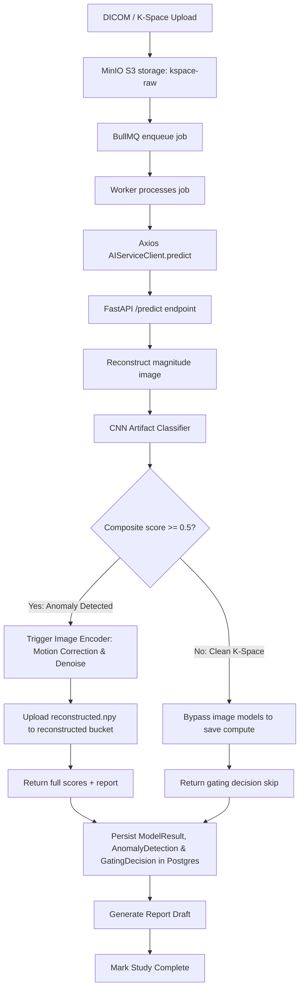

# 🏛️ MedMatrix Architecture Overview

This document tracks the high-level architecture, technology stack, and inter-service data flow of the **MedMatrix** (KVISION / NeuroScan AI) workspace.

---

## 🏗️ Repository Layout

MedMatrix is a monorepo managed using `pnpm` workspaces:

```
Med_Matrix/
├── 🐳 docker-compose.yml        <- Orchestrates Postgres, Redis, MinIO, AI Service, and Backend
├── 📓 PhantomNet_multiclass600.ipynb  <- Kaggle notebook for remote GPU training
├── 📊 training_progress.log     <- Live training progress log (synced from remote)
├── 🤖 ai-service/                <- Python-based AI microservice (FastAPI + PyTorch)
│   ├── fused_model_128.onnx     <- Production ONNX model (128-res, 88.28% val acc)
│   ├── fused_model_128.pt       <- PyTorch checkpoint (128-res)
│   ├── main.py                  <- FastAPI application entrypoint with /reconstruct and /predict
│   ├── models.py                <- Pydantic schemas for request/response validation
│   ├── fused_model.py           <- Hybrid S4-CNN Fused Volumetric Classifier (complex-valued)
│   ├── fused_model_onnx.py      <- ONNX-compatible real-valued twin model module
│   ├── cnn_model.py             <- Parameter-efficient Conv2D spatial branch module
│   ├── s4_model.py              <- Complex-valued S4 sequence branch module
│   ├── train.py                 <- Multi-GPU training script with DDP
│   ├── export_onnx.py           <- Export script mapping trained checkpoint to ONNX
│   ├── export_fused_onnx.py     <- Fused model ONNX export helper
│   ├── generate_synthetic_dataset.py <- Volumetric K-space synthetic generator
│   ├── find_max_batch.py        <- GPU memory batch-size finder utility
│   ├── python_sim.py            <- Numerical brain phantom K-space simulator
│   ├── numerical_brain_cropped.mat <- MATLAB phantom data for simulation
│   ├── kspace_reader.py         <- Siemens Twix .dat, fastMRI .h5, and NumPy .npy parser
│   ├── reconstruction.py        <- 2D centered IFFT, RSS coil combination, phase correction
│   ├── motion_correction.py     <- SimpleITK retrospective rigid registration
│   ├── denoiser.py              <- BM3D baseline and PyTorch residual DnCNN denoiser
│   ├── artifact_detector.py     <- ResNet CNN artifact classifier
│   └── inference/               <- C++ ONNX Runtime inference engine
│       ├── CMakeLists.txt       <- CMake build config (ONNX Runtime + protobuf/abseil)
│       ├── kvision_inference.h  <- C++ header: InferenceEngine, KSpaceDims, result structures
│       ├── kvision_inference.cpp <- Implementation: CUDA/CPU backends, softmax, argmax
│       └── test_inference.cpp   <- 10-test CLI runner (loading, accuracy, determinism, throughput)
├── 📱 apps/
│   ├── 🖥️ electron/             <- Desktop frontend app (Electron + React + TS)
│   │   ├── src/main/            <- Main process, IPC bridges, and window control
│   │   └── src/renderer/        <- React app with Ingest, Archive, Patients, and AI Reports tabs
│   └── 🌐 backend/              <- Node/TypeScript Express backend server
│       ├── prisma/              <- Prisma Schema and migrations (Postgres)
│       └── src/
│           ├── index.ts         <- Server entrypoint (initializes BullMQ worker)
│           ├── ai-client.ts     <- Axios-based wrapper for FastAPI /predict + DB persistence
│           ├── worker.ts        <- BullMQ background worker for study-processing jobs
│           ├── queue.ts         <- Job enqueuing helper
│           ├── dicom.ts         <- DICOM metadata parser
│           └── storage.ts       <- MinIO S3 client wrapper
├── 🦀 rust-mri/                  <- Rust MRI processing prototype
│   ├── Cargo.toml
│   └── src/
└── 📦 packages/
    ├── ⚙️ config/               <- Shared eslint/prettier/typescript configs
    └── 🧩 shared-types/         <- Shared TS interfaces across electron and backend
```

---

## 🛠️ Technology Stack

### 1. Electron Frontend (`apps/electron`)
*   **Runtime/Container**: Electron v29, TypeScript.
*   **Interface**: React v18, styled using a customized clinical theme (Vanilla CSS).
*   **3D Visualization**: Cornerstone3D (DICOM rendering) and Three.js / VTK.js (volumetric 3D brain/lesion nodes).
*   **Analytics**: Recharts for patient risk profiling.

### 2. Node.js Backend (`apps/backend`)
*   **Runtime**: Node.js v20, Express, TypeScript.
*   **Database ORM**: Prisma client interacting with a PostgreSQL 16 database.
*   **Task Queue**: BullMQ backed by Redis for asynchronous job processing.
*   **Object Storage**: MinIO S3 SDK for binary data storage (raw K-space and reconstructed magnitude slices).

### 3. Python AI Service (`ai-service/`)
*   **Web Framework**: FastAPI.
*   **Deep Learning**: PyTorch + torchvision (DnCNN denoiser, ResNet artifact classifier, Fused S4-CNN classifier).
*   **Medical Image Processing**: SimpleITK (rigid registration), NumPy, and scikit-image.
*   **Data Formats**: `h5py` for fastMRI `.h5` files, custom Siemens Twix binary parser.
*   **Training**: Remote GPU training on Kaggle (2× Tesla T4 GPUs) with Distributed Data Parallel (DDP).

### 4. C++ Inference Engine (`ai-service/inference/`)
*   **Runtime**: ONNX Runtime 1.24.4 C++ API.
*   **GPU**: CUDA Execution Provider for NVIDIA GPU acceleration.
*   **Build**: CMake 3.18+, GCC 16, with protobuf + abseil-cpp transitive dependencies.
*   **Performance**: ~84.8 inferences/sec on GPU, ~12.6 inferences/sec on CPU.

### 5. Rust MRI Prototype (`rust-mri/`)
*   Early-stage prototype for high-performance MRI data processing in Rust.

---

## 🔄 Phase 2: K-Space Anomaly Detection & Gating Flow

The core workflow involves an automated, two-tier AI cascade to optimize compute and preserve detail:



### Database Tables (Phase 2 Schema)
*   **ModelResult**: Logs metadata for each inference run (e.g. model name, version, composite score, and reconstructed key).
*   **AnomalyDetection**: Stores specific probability scores (`ghostingScore`, `wrapAroundScore`, `zipperScore`), composite score, and whether it was flagged.
*   **GatingDecision**: Records whether the second-stage image encoder was triggered, the composite confidence, and the clinical reasoning string.

---

## ⚙️ Fused S4-CNN Classifier & C++ Inference Engine

For Phase 3/4, the platform integrates a **Hybrid Fused Volumetric MRI Classifier** combining a Frequency (S4 SSM) branch and a Spatial (Conv2D CNN) branch with Slice-Level Cross-Attention.

*   **Model Representation:** Exported to `fused_model_128.onnx` (4.3 MB, ~281k parameters) using a real-valued twin architecture.
*   **Input Shape:** `[batch, 8, 16, 128, 128, 2]` — 8 slices × 16 coils × 128×128 spatial × real/imaginary.
*   **C++ Engine:** Coded in C++ with ONNX Runtime (`ai-service/inference/`) supporting GPU-accelerated (CUDA) and CPU fallbacks. All 10 tests pass on both backends.
*   **Detailed Notes:** See [memories/inference.md](inference.md) for model math, shapes, and inference pipeline steps.

### Training Evolution
| Run | Patients | Resolution | Epochs | Peak Val Acc | Parameters |
|:---|:---:|:---:|:---:|:---:|:---:|
| Run 1 (initial) | 100 | 128 | 10 | 42.86% | ~67M |
| Run 2 (resume) | 100 (new) | 128 | 10 | 50.00% | ~67M |
| Run 3 (256-res) | 300 | 256 | 50 | 57.81% | ~67M |
| **Run 4 (production)** | **600** | **128** | **50** | **88.28%** | **~281k** |

---

## ⚙️ Package Management & Tooling
*   **Package Manager**: `pnpm` (monorepo workspaces defined in `pnpm-workspace.yaml`).
*   **Linter & Formatter**: ESLint and Prettier.
*   **Build System**: CMake (C++ inference), pip (Python AI service).
