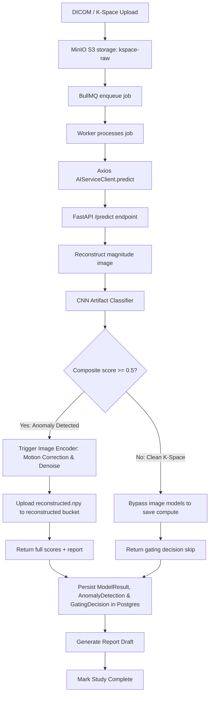

# 🏛️ KVISION Architecture Overview

This document tracks the high-level architecture, technology stack, and inter-service data flow of the **KVISION** (MedMatrix / NeuroScan AI) workspace.

---

## 🏗️ Repository Layout

KVISION is a monorepo managed using `pnpm` workspaces:

```
KVISION/
├── 🐳 docker-compose.yml        <- Orchestrates Postgres, Redis, MinIO, AI Service, and Backend
├── 🤖 ai-service/                <- Python-based AI microservice (FastAPI + PyTorch)
│   ├── main.py                  <- FastAPI application entrypoint with /reconstruct and /predict
│   ├── models.py                <- Pydantic schemas for request/response validation
│   ├── kspace_reader.py         <- Parser for Siemens Twix (.dat), fastMRI (.h5), and NumPy (.npy)
│   ├── reconstruction.py        <- Centered 2D IFFT, RSS coil combination, 1D/2D phase correction
│   ├── motion_correction.py     <- SimpleITK retrospective rigid registration
│   ├── denoiser.py              <- BM3D baseline and PyTorch DnCNN residual denoiser
│   └── artifact_detector.py     <- ResNet CNN artifact classifier (ghosting, wrap-around, zipper noise)
├── 📱 apps/
│   ├── 🖥️ electron/             <- Desktop frontend app (Electron + React + TS)
│   │   ├── src/main/            <- Main process, IPC bridges, and window control
│   │   └── src/renderer/        <- React app with Ingest, Archive, Patients, and AI Reports tabs
│   └── 🌐 backend/              <- Node/TypeScript Express backend server
│       ├── prisma/              <- Prisma Schema and migrations (Postgres)
│       └── src/
│           ├── index.ts         <- Server entrypoint (initializes BullMQ worker)
│           ├── ai-client.ts     <- Axios-based wrapper for FastAPI /predict + DB persistence
│           ├── worker.ts        <- BullMQ background worker running study-processing jobs
│           ├── queue.ts         <- Job enqueuing helper
│           ├── dicom.ts         <- DICOM metadata parser
│           └── storage.ts       <- MinIO S3 client wrapper
└── 📦 packages/
    ├── ⚙️ config/               <- Shared eslint/prettier/typescript configs
    └── 🧩 shared-types/         <- Shared TS interfaces across electron and backend
```

---

## 🛠️ Technology Stack

### 1. Electron Frontend (`apps/electron`)
*   **Runtime/Container**: Electron v29, TypeScript.
*   **Interface**: React v18, styled using a customized clinical theme (Vanilla CSS).
*   **3D Visualization**: Cornerstone3D (DICOM rendering) and Three.js / VTK.js (volumetric 3D brain/lesion nodes).
*   **Analytics**: Recharts for patient risk profiling.

### 2. Node.js Backend (`apps/backend`)
*   **Runtime**: Node.js v20, Express, TypeScript.
*   **Database ORM**: Prisma client interacting with a PostgreSQL 16 database.
*   **Task Queue**: BullMQ backed by Redis for asynchronous job processing.
*   **Object Storage**: MinIO S3 SDK for binary data storage (raw K-space and reconstructed magnitude slices).

### 3. Python AI Service (`ai-service/`)
*   **Web Framework**: FastAPI.
*   **Deep Learning**: PyTorch + torchvision (DnCNN denoiser, ResNet artifact classifier).
*   **Medical Image Processing**: SimpleITK (rigid registration), NumPy, and scikit-image.
*   **Data Formats**: `h5py` for fastMRI `.h5` files, custom Siemens Twix binary parser.

---

## 🔄 Phase 2: K-Space Anomaly Detection & Gating Flow

The core workflow of KVISION involves an automated, two-tier AI cascade to optimize compute and preserve detail:



### Database Tables (Phase 2 Schema)
*   **ModelResult**: Logs metadata for each inference run (e.g. model name, version, composite score, and reconstructed key).
*   **AnomalyDetection**: Stores specific probability scores (`ghostingScore`, `wrapAroundScore`, `zipperScore`), composite score, and whether it was flagged.
*   **GatingDecision**: Records whether the second-stage image encoder was triggered, the composite confidence, and the clinical reasoning string.

---

## ⚙️ Fused S4-CNN Classifier & C++ Inference Engine
For Phase 3/4, the platform integrates a **Hybrid Fused Volumetric MRI Classifier** combining a Frequency (S4 SSM) branch and a Spatial (3D CNN) branch with Slice-Level Cross-Attention.
*   **Model Representation:** Exported to [fused_model.onnx](file:///home/jemin/Projects/MRI/KVISION/ai-service/fused_model.onnx) using a real-valued twin architecture to emulate complex-valued recurrence.
*   **C++ Engine:** Coded in C++ with ONNX Runtime (`ai-service/inference/`) supporting GPU-accelerated (CUDA) and CPU fallbacks. Inputs are structured as `[1, 64, 1, 128, 128, 2]` flat floats (real/imaginary stacked).
*   **Detailed Notes:** See [memories/inference.md](file:///home/jemin/Projects/MRI/KVISION/second-brain/memories/inference.md) for math designs, shape properties, and inference pipeline execution steps.

---

## ⚙️ Package Management & Tooling
*   **Package Manager**: `pnpm` (monorepo workspaces defined in `pnpm-workspace.yaml`).
*   **Linter & Formatter**: ESLint and Prettier.


